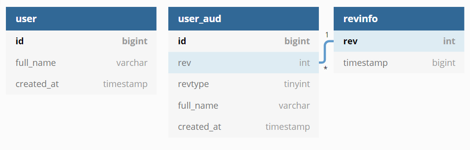
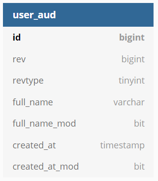
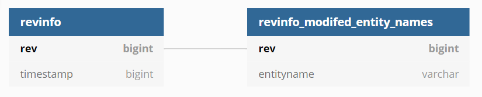

## 개요
- 프로젝트를 수행하다 보면 데이터 이력관리가 필요합니다.
Envers는 데이터의 추가, 수정, 삭제에 대한 모든 이력을 Entity 기준으로 자동으로 관리해 주기 때문에 이러한 고민을 덜어주는 아주 훌륭한 라이브러리입니다.

## Envers

- 데이터 변경 이력을 로깅하기 위한 라이브러리입니다.
- JPA 스펙에 정의된 모든 매핑을 감사합니다.
- 엔티티의 변경 이력을 자동으로 관리합니다.

## 설정
1. Build.gradle에 dependency를 추가합니다.
```kotlin
implementation("org.hibernate:hibernate-envers")
```
2. Entity에 @Audited 어노테이션 추가합니다.
```kotlin
@Entity
@Audited
@Table(name = "user")
data class User()
```

- user_table_aud, revinfo 테이블이 생성됩니다.
- revinfo는 central revision table입니다.
- revtype은 생성, 수정, 삭제를 구분하는 컬럼입니다.

  |revtype|구분|
  |---|---|
  |0|추가|
  |1|수정|
  |2|삭제|

3. Propety Config
```yaml
spring:
  jpa:
    properties:
      org:
        hibernate:
          envers:
            audit_table_suffix: _aud
            revision_field_name: rev 
            revision_type_field_name: revtype
            store_data_at_delete: true
```
- audit table의 prefix, suffix를 수정할 수 있습니다.
- revision_field, type의 name 수정 가능합니다.
- delete시 aud테이블에서 타겟 테이블의 pk만 쌓을뿐 다른 필드의 값은 기본적으로 null입니다.
- null이 아니라 delete 직전의 모든 필드의 값을 쌇고 싶다면 true로 설정합니다.

4. CustomRevisionEntity
```kotlin
@Entity
@RevisionEntity
class CustomRevisionEntity : Serializable {
    @Id
    @GeneratedValue
    @RevisionNumber
    private val rev: Long = 0

    @RevisionTimestamp
    private val timestamp: Long = 0
}
```
- revinfo의 pk인 rev컬럼은 기본적으로 int로 되어있습니다.
- 데이터가 20억개 이상 넘어가면 오류가 발생하므로 rev를 long으로 변경합니다.

## 기능
1. 필드 변경 여부 관리

```kotlin
@Entity
@Audited(withModifiedFlag = true)
@Table(name = "users")
data class Users()
```


- @Audited(withModifiedFlag = true) 추가합니다.
- AUD 테이블에 필드마다 수정 상태 컬럼 추가됩니다.
- ex) NAME → NAME_MOD
- 어떤 필드를 수정했는지 알 수 있습니다.
- 필드의 수정여부를 검색조건으로 사용 가능합니다.

2. 변경된 엔티티 관리
- property 추가
```yaml
org:
  hibernate:
    envers:
      track_entities_changed_in_revision: true
```
- customRevisionEntity 생성한 경우 modifiedEntityNames 추가해야 합니다.
```kotlin
@Entity
@RevisionEntity
data class Revinfo (
    @Id
    @GeneratedValue
    @RevisionNumber
    val rev: Long = 0,

    @RevisionTimestamp
    var timestamp: Long = 0,

    @ElementCollection(fetch = FetchType.EAGER)
    @Column(name = "ENTITYNAME")
    @ModifiedEntityNames
    val modifiedEntityNames: Set<String>? = null
)
```

- 같은 트랜잭션에서 함께 변경된 엔티티를 저장합니다.

  |rev|entityname|
  |---|---|
  |1|spring.envers.entity.User|


## 참고 사이트
- Hibernate envers 공식 사이트 : [https://hibernate.org/orm/envers/](https://hibernate.org/orm/envers/)  

